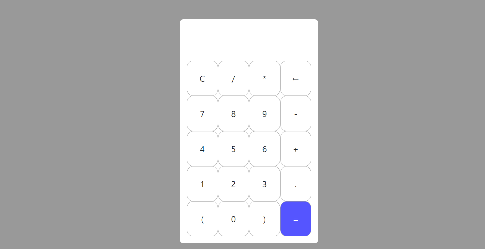

# Simple Calculator

[](https://github.com/diogosarti/simple-calculator)




>   A simple calculator.

### Test

If you want tests, you can access the github page:

[diogosarti.github.io/simple-calculator](https://diogosarti.github.io/simple-calculator/)


## 💻 Pré-requirements

Before you start, make sure you've met the following requirements:

* Have you installed the latest version of `gti`

## 🚀 Installing Simple Calculator

To install simple calculator, follow these steps:

Any system with `git` installed:
```
git clone https://github.com/diogosarti/simple-calculator.git
```

## ☕ Using Simple Calculator

To use the Simple calculator, follow these steps:

Open the file
```
index.html
```

## 📫 contributing to Simple Calculator


To contribute Simple Calculator, follow these steps:

1. Fork this repository.
2. create a branch: `git checkout -b <branch_name>`.
3. Make your changes and commit them: `git commit -m '<commit_message>'`
4. Push to original branch: `git push origin simple-calculator / <local>`
5. Create the pull request.

Alternatively, see the GitHub documentation at [how to create a pull request](https://help.github.com/en/github/collaborating-with-issues-and-pull-requests/creating-a-pull-request).

## 🤝 Contributors

We thank the following people who contributed to this project:

<table>
  <tr>
    <td align="center">
      <a href="https://github.com/diogosarti">
        <br>
        <sub>
          <b>Diogo Sarti</b>
        </sub>
      </a>
    </td>
  </tr>
</table>


## 😄 Be one of the contributors<br>

Want to be part of this project? [Click Here](CONTRIBUTING.md) and read how to contribute.

## 📝 License

This project is under License. see the file [License](LICENSE.md) for more details.

[⬆ Back to the top](#simple-calculator)<br>